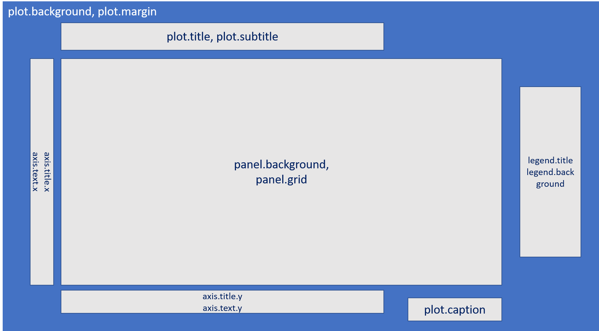

```{r setup, include=FALSE}
knitr::opts_chunk$set(echo = TRUE,
                      message = FALSE,
                      warning = FALSE)
```

This workshop book is made as complement material for Data Science Role in Industry 4.0 workshop that held by President University major Association Computing. This workshop book contains Data Visualization material in ggplot2 to tell more about the data.

# Objectives

The primary objective of this workshop is to introduce Data Science Role in Industry 4.0. In particular, the purposes is to introduce about data visualization in R. Hence, this workshop is focused on achieving the following objectives:   

- To introduce R and RStudio in general   
- To introduce packages needed to build a visualization   
- To produce a plot using ggplot2 in R   
- To gain insight from plot   

This is an RMarkdown, the tools that provide a documentation friendly for R user. The idea of RMarkdown was to embed code chunks of R languages in Markdown documents so it will be accessed friendly for people who have not programming background read the documentation. This is the example of big company like [Airbnb](https://peerj.com/preprints/3182.pdf) uses RMarkdown for their knowledge repository. 

To run the code below, you can click on the `green-triangle-button` on the chunk (the lines that has grey color) or you can just type `ctrl+enter` on your keyboard. To make this document to be accessed friendly, you can klik `knit` button on the menu at the top. The file will produce a `.html` file so you can read it in mobile or pc eventhough the R and RStudio is not installed. 

Now, let's begin our data visualization in R experience!

# Load the library needed
Library or package is the collection of function that will help us work in R. The aims when using library is we do not have to wrote a long function to produce output. The library we used today are ggplot2, plotly, and tidyverse.
```{r}
library(ggplot2) # to help us in making plot
library(dplyr) # to help us do the data wrangling
library(ggrepel) # to make a better geom_text
library(stringr) # to handle the regular expression
```

# Read and inspect the data
Before we dive deeper on making plots, we should load and inspect our data first to have some knowledge about the data itself. Today, we will use a `recent-grads.csv` data, so we have to load it first. The data that has been available in our folder. We can load the data to our RStudio environment by calling the `read.csv()` function and then assign to object using `<-`.
```{r}
major <- read.csv("recent-grads.csv")
major
```

Besides, to inspect our data, we can use `str()` function that stands for structure, so we can know a glimpse of our structure data.
```{r}
str(major)
```

The explanation about the data

The data has 173 observations and 21 variables. The data is downloaded from [tidytuesday github repository](https://github.com/rfordatascience/tidytuesday/tree/master/data/2018/2018-10-16) about the economic guide to picking a college major in USA. Here is the description of each variables:

- Rank:	Rank by median earnings
- Major_code:	Major code, FO1DP in ACS PUMS
- Major: description
- Major_category:	Category of major from Carnevale et al
- Total:	Total number of people with major
- Sample_size:	Sample size (unweighted) of full-time, year-round ONLY (used for earnings)
- Men:	Male graduates
- Women:	Female graduates
- ShareWomen:	Women as share of total
- Employed:	Number employed (ESR == 1 or 2)
- Full_time:	Employed 35 hours or more
- Part_time:	Employed less than 35 hours
- Full_time_year_round:	Employed at least 50 weeks (WKW == 1) and at least 35 hours (WKHP >= 35)
- Unemployed:	Number unemployed (ESR == 3)
- Unemployment_rate:	Unemployed / (Unemployed + Employed)
- Median:	Median earnings of full-time, year-round workers
- P25th:	25th percentile of earnigns
- P75th:	75th percentile of earnings
- College_jobs:	Number with job requiring a college degree
- Non_college_jobs:	Number with job not requiring a college degree
- Low_wage_jobs	Number: in low-wage service jobs

# Know what the question to answer

Before we do the data wrangling and visualization, we should know what kind of problems to solve, so we know what variables we need and what kind of visualizations we want to get a deeper information based on the data we have. 

A Question to answer:

As a freshman college students in President University who has majoring in Association Computing, we want to estimate how competitive our major will be based on the data we have and what the data-science related major in today's job position.

# Data Wrangling

Data wrangling  is the process of transforming and mapping data from one "raw" data form into another format with the intent of making it more appropriate and valuable for a variety of downstream purposes such as analytics. In this phase, we want to reduce our variable/column by removing unnecessary variables. 

Here, we want to do a simple data wrangling, that is change the type of variable and remove the unnnecessary variable 
```{r}
major2 <- major %>% 
  mutate(Major_category = as.factor(Major_category),
         Median = as.factor(Median)) %>% 
  select(-c(1,2))
major2
```

To answer the problem we have, we should make a limitation to focus on looking the data. Since our major is Association computing, the major category in data that similar with our major is `Computers & Mathematics`. We then filter our data only for `Major Category == "Computers & Mathematics"`
 
```{r}
comp <- major2 %>% 
  filter(Major_category == "Computers & Mathematics")
comp
```

# Hands-on Data Visualization

Data Visualization is the graphical representation of data. To make our first visualization of our data, that usually called by plot. There is a powerful package named `ggplot2` that helps us to make a prettier visualization. 

## About ggplot2

The ggplot2 is a powerful package to visualize your data. To help you work in ggplot2, you can downloaded the cheatsheet on the RStudio menu **Help-Cheatsheet-Data Visualization with ggplot2**. 

The visualization using ggplot2 is like we're painting in a canvas because it works in layering, so when you want to add something, you just put `+` right after your last function. The next section will explain step-by-step how to do a visualization using ggplot2. 

## Create a canvas

Before we create our plot based on the data we have, we should make our canvas first using `ggplot()` function from `ggplot2` package. In `ggplot()` function, we should store `data =` argument to add the data, and `mapping =` argument to specify our x and y variables.

```{r}
ggplot(data = comp, mapping = aes(x = Median, y = Unemployment_rate)) 
```

## Add a geometrical element

Geometrical element is an element we should specified of what kind of plot we wants. The x and y axes we specified in `ggplot()` function is not draw any of plot because we have not define our geometrical element yet. In ggplot2, you should define geometrical element using these functions:  

- geom_point() = produce a scatter plot   
- geom_line() = produce a line plot   
- geom_text() = produce text    
- geom_col() = produce a bar plot   

resource: ggplot2 cheatsheet to see a complete geometry element

Because we want to see the distribution plot of Employed and Unemployed data from college students, we will use a `geom_point()`.

```{r}
ggplot(data = comp, mapping = aes(x = Median, y = Unemployment_rate)) +
  geom_jitter()
```

## Add another geometrical element

In ggplot2, we can use one or more geometrical element. We will add another geometrical element, that is `geom_text_repel()` from `ggrepel` package to give more information when others see our visualization. 

We want to see specific Major, then we should specify what them majors and save it in the object named `label`.

Then we just put `+` to add another geometrical element as a new layer.

```{r}
ggplot(data = comp, mapping = aes(x = Median, y = Unemployment_rate)) +
  geom_jitter() +
  geom_text_repel(aes(label = str_to_title(Major)), data = comp)
```

## Add graphical furniture

### Add Color and Size furniture

In ggplot2, we can add graphical furniture like color, shape, size of point, etc. In this plot, we want to make our plot prettier by adding color and size based on variables we have in our data. Then, we add `col =` argument in `geom_point(mapping = aes())`.

```{r}
ggplot(data = comp, mapping = aes(x = Median, y = Unemployment_rate)) +
  geom_jitter(mapping = aes(col = Major, size = Low_wage_jobs)) +
  geom_text_repel(mapping = aes(label = str_to_title(Major), 
                                col = Major), 
                  data = comp)
```

## Remove the legend

To remove the legend, we can add another layer that is `guides()` function, then specify what kind of legend we want to remove. Here, we want to remove the colour and size point of our plot, hence we define the `col = FALSE` and `size = FALSE` into `guides()` 

```{r}
ggplot(data = comp, mapping = aes(x = Median, y = Unemployment_rate)) +
  geom_point(mapping = aes(col = Major, size = Low_wage_jobs)) +
  geom_text_repel(mapping = aes(label = str_to_title(Major), 
                                col = Major), 
                  data = comp)+
  guides(col = FALSE, size = FALSE)
```


### Add labels furniture

To add label like title, subtitle, x-axis, y-axis, caption, etc. we can add another layer that is `labs()` and specify the information related to our plot.

```{r}
ggplot(data = comp, mapping = aes(x = Median, y = Unemployment_rate)) +
  geom_jitter(aes(col = Major, size = Low_wage_jobs)) +
  geom_text_repel(aes(label = str_to_title(Major), col = Major), size = 3.5, data = comp) +
  guides(col = F, size = F)+
  labs(x = "Median earnings of full-time workers", 
       y = "Unemployment rate", 
       title = "Median earnings of full time workers vs Unemployment rate in Computer and Mathematics Major Category",
       caption = "Source: Tidy Tuesday Dataset")
```

### Custom your theme

To custom your theme, you can refer to this picture
{ width=85% }

We can custom whatever we want and use the function based on the area above. Here is the example of our custom plot.

```{r}
ggplot(data = comp, mapping = aes(x = Median, y = Unemployment_rate)) +
  geom_jitter(aes(col = Major, size = Low_wage_jobs)) +
  geom_text_repel(aes(label = str_to_title(Major), col = Major), data = comp) +
  guides(size = F, col = F) +
  labs(x = "Median earnings of full-time workers", 
       y = "Unemployment rate", 
       title = "Median earnings vs Unemployment rate in Computer and Mathematics Major",
       caption = "Source: Tidy Tuesday Dataset")+
  theme(panel.grid = element_blank(),
        plot.background = element_rect(fill = "black"),
        panel.background = element_rect(fill = "black"),
        plot.title = element_text(hjust = 1, face = "bold", colour = "white"),
        axis.title = element_text(colour = "white", face = "bold"),
        axis.text = element_text(colour = "white", face = "bold"),
        legend.title = element_blank(),
        plot.caption = element_text(colour = "white", face = "bold"))
```

# Insight

From the plot we have made, we get the information that:   
1. There are so many job that require computer science major, but these job are quite competitive because the median-earnings is the highest but the size of point (Low_wage_jobs) is the biggest too. It means, so many outlier (people who have very high earnings)   
2. Also, if we refer to data science job related, in 2018 the majors like Mathematics and Computer Science have quite high median earnings and the unemployment rate is the lowest, means the demand is so high.

# Reference
- [About ggplot2](https://ggplot2.tidyverse.org/reference/)
- [Color Pallete cheatsheet](http://guianaplants.stir.ac.uk/seminar/materials/colorPaletteCheatsheet.pdf)
- Knaflic, Cole Nussbaumer. 2015. Storytelling with Data: a data visualization guide for business profesional
