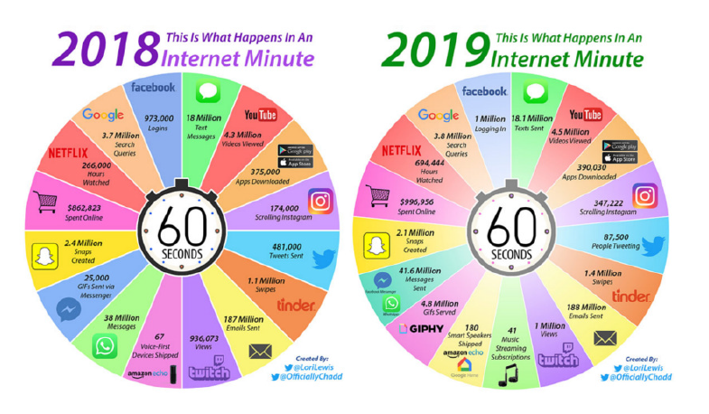
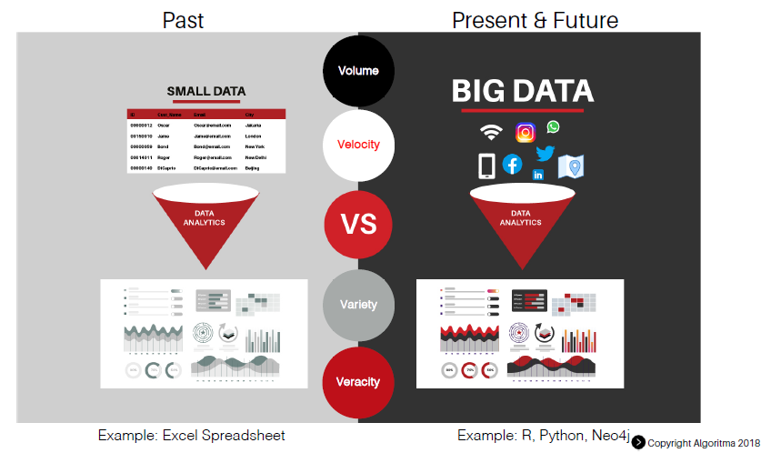
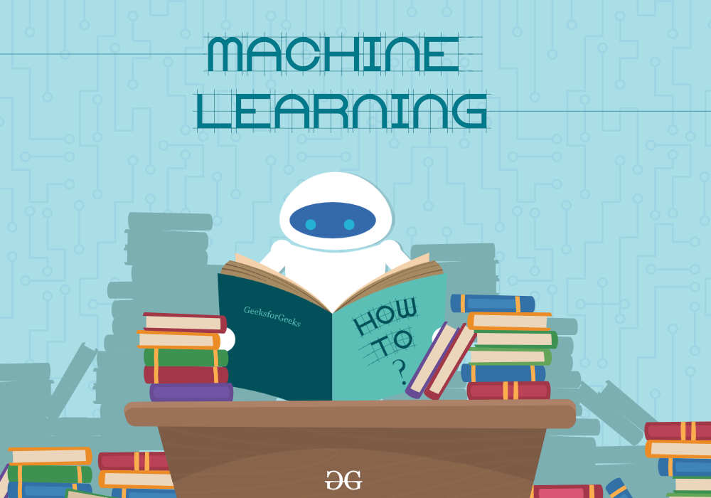

```{r, include=FALSE}
knitr::opts_chunk$set(
  message = FALSE,
  warning = FALSE,
  fig.asp = 0.75,
  fig.align = "center",
  out.width = "100%",
  collapse = TRUE,
  comment = "#>"
)
```


```{r, include=FALSE}
library(tidyverse)
library(plotly)
library(stringi)
library(knitr)
```

# Disclaimer

---

```{r, echo=FALSE, out.width="45%", fig.align="left"}
knitr::include_graphics("assets/logo.png")
```

<br>
<div style="text-align: left">
The following presentation is produced by the team at [Algoritma](https://algorit.ma) for Data Science Role in Industry 4.0 workshops. This presentation is intended for a restricted audience only. It may not be reproduced, distributed, translated or adapted in any form outside these individuals and organizations without permission.
</div>

# Data Science Role in Industry 4.0

---

<div style="text-align: left">
## Industrial Revolution 4.0
</div>
<hr>


---

<div style="text-align: left">
## Tech Impact in Jobs in Indonesia
</div>
<hr>


<font size="5"><div style="text-align: right">  *Oxford Economics, Cisco* </font></div>

---

<div style="text-align: left">
## Demand and trend of job roles
</div>
<hr>


---

<div style="text-align: left">
## Today's largest company
</div>
<hr>


---

<div style="text-align: left">
## Data
</div>
<hr>




## 


---

## So, what kind of knowledge should we have?

---

# A Data Science

---

<div style="text-align: left">
## What is Data Science?
</div>
<hr>

{ width=60% }

<style>
.reveal section img { background:none; border:none; box-shadow:none; }
</style>

---

<div style="text-align: left">
## What are skills needed to be a data scientist?
</div>
<hr>
- Technical Skills : Programming, Statistics, Mathematics
- Non Technical Skills : Intellectual curiosity, Business acumen, Communication skills

---

# What are the tools needed?

## One of the tools is Programming Language

{ width=25% } { width=30% }

# Data Science Workflow

---

{width='80%'}

<font size="5"><div style="text-align: right">  *JuliaStewart Lowndes at useR 2019* </font></div>

---

# Data Visualization

---

<div style="text-align: left">
## How you will learn to tell stories with data?
</div>
<hr>

1. Understand the context
2. Who is your audience? What do you need them to know or do?
3. Choose an appropriate visual display
3. Tell a story and making point
4. Most data visualization is done for the purpose of communication

---

<div style="text-align: left">
## The Goal of Visualization
</div>
<hr>
* **Exploratory**
<br>
 to uncover data  
 to *analyze* data
<br>
<br>
* **Explanatory**
<br>
 to communicate data  
 to *present* data  

---

# Data Visualization Example

---

<div style="text-align: left">
## Tabular Data
</div>
<hr>
```{r results='asis'}
library(stringr)
set.seed(1020)
dat <- read.csv("recent-grads.csv")
kable(dat[sample(1:nrow(dat), 5),c(7,12,15,16)], caption = "Recent Grads 2018") 
```

---

<div style="text-align: left">
## Visualization
</div>
<hr>
```{r echo = FALSE}
dat2 <- dat %>% 
  group_by(Major_category) %>% 
  summarise(Part_time = mean(Part_time))
```

```{r echo = FALSE}
dat2 %>% 
  ggplot(aes(x = reorder(Major_category, Part_time), y = Part_time)) +
  geom_col(aes(fill = Part_time)) +
  geom_text(aes(label = round(Part_time,2), hjust = -0.1), size = 3.5) +
  coord_flip() +
  labs(title = "Mean of Part Time based on Major Category",
       caption = "Source: Tidy Tuesday Dataset",
       y = NULL,
       x = NULL) +
  theme_minimal() +
  scale_y_continuous(limits = c(0,25000)) +
  guides(fill = FALSE) 
```

---

# A Brief intro to Machine Learning

---

<div style="text-align: left">
## Machine Learning
</div>
<hr>

{ width=60% }

<div style="text-align: left">
Gives "computers the ability to learn without being explicitly programmed"
</div>

<font size="5"><div style="text-align: right">  *Arthur Samuel, 1959* </font></div>


---

<div style="text-align: left">
## External Links
</div>
<hr>

<div style="text-align: left">
If you want to explore about R, Data Visualization, and Machine Learning: 
</div>
<div style="text-align: left">
- Book about [R for data science](https://r4ds.had.co.nz/) 
</div>
<div style="text-align: left">
- Book about [RMarkdown](https://bookdown.org/yihui/rmarkdown/)  
</div>
<div style="text-align: left">
- About [Data Visualization using ggplot2](https://ggplot2.tidyverse.org/)  
</div>
<div style="text-align: left">
- E-book about [machine learning](https://www.dropbox.com/s/e38nil1dnl7481q/machine_learning.pdf?dl=0)
</div>

---

# Thank you

## 
If you guys still have any questions, say hi to me at 

sitta@algorit.ma